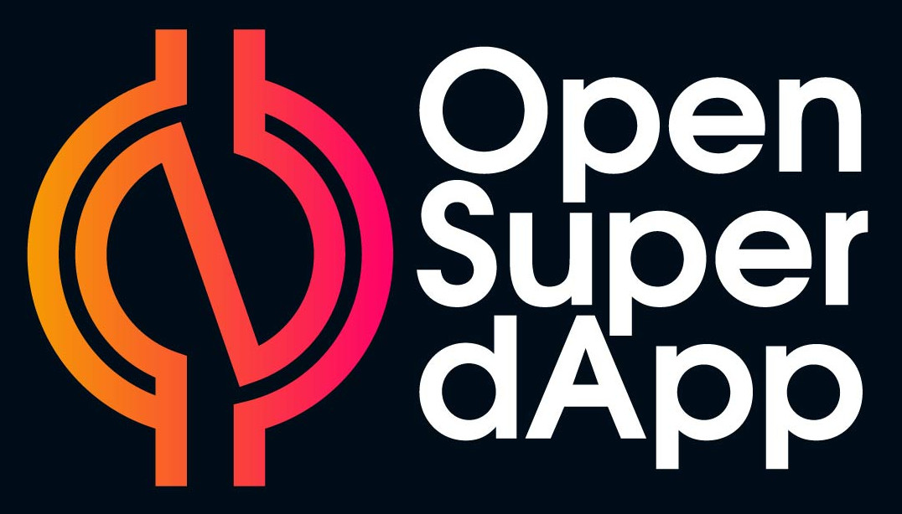

## Open Super dApp
#### 🚀 Your Gateway to the New Digital Commons 🚀
A fully open source, open standard, decentralized ["super app"](https://en.wikipedia.org/wiki/Super-app) including a secure, encrypted [Matrix](https://matrix.org/) compatible messenger based off of the [Element Messenger](https://element.io/), and an Ethereum crypto wallet and [web3](https://en.wikipedia.org/wiki/Web3) browser based off of [Alpha Wallet](https://alphawallet.com/). Of, by, and for all people of the world.

**_This software is pre-alpha, actively seeking contributors, donors and maintainers/leaders. Get in on the ground floor and help build something amazing!_**

**_To donate, please use the [Paypal donate button on our website](https://2gather.one/)!_**

_The OSD team plans to set up on [Open Collective](https://opencollective.com/) or similar platform for open budgeting and collaboration as soon as practical._

### Mission
Open Super dApp aims to foster, and provide access to, a decentralized and secure digital [commons](https://en.wikipedia.org/wiki/Commons) for all.

### Goals and Principles
* To be a [copyleft](https://en.wikipedia.org/wiki/Copyleft) open source project.
* To be safe and secure.
* To provide all of the capabilities inherent in private "super apps" of today.
* To be democratically controlled, with its users as it primary stakeholders, rather than private shareholders.
* To demonstrate that we do not need private, corporate ["walled gardens"](https://en.wikipedia.org/wiki/Closed_platform)
* To introduce people to the power of the emerging digital commons.

### License
Open Super dApp is licensed with the [Cryptographic Autonomy License 1.0](LICENSE), which essentially has [two consequences](https://medium.com/holochain/understanding-the-cryptographic-autonomy-license-172ac920966d): 

1. The source code and any derivative works must be provided under compatible open source terms which include this condition and the following condition related to privacy of cryptographic keys.
2. You only have permission for "public performance" of Open Super dApp if you preserve each end-user's privacy and autonomy of their private cryptographic keys and data.

We have chosen this license because we want Open Super dApp to help to grow a new public, digital commons. We explicitly want to be an alternative to for-profit, proprietary ["walled gardens"](https://en.wikipedia.org/wiki/Closed_platform). 

> Note: The two main projects from which which Open Super dApp is created have more permissive licenses. [Element](https://github.com/vector-im/element-android/blob/develop/LICENSE) is licensed under the Apache License 2.0, and [Alpha Wallet](https://github.com/AlphaWallet/alpha-wallet-android/blob/master/LICENSE) is licensed under the MIT License.

### Project Structure
Open Super dApp gratefully builds off the excellent open source mobile apps Element Messenger and Alpha Wallet. We leverage these projects by being "downstream" of them, leveraging, integrating, and extending their work. 

### Development
This app can be developed using [Android Studio](https://developer.android.com/studio/), using standard development flows and techniques.

The main repo branch is `main` for code that has been released. WIP branches are squash merged onto main in preparation for new releases.

#### Upgrading Element and AlphaWallet
Open Super dApp is "downstream" of the [element-android](https://github.com/vector-im/element-android) and [alpha-wallet-android](https://github.com/AlphaWallet/alpha-wallet-android) projects. This means that when either project issues a new releases, this new release can be merged into Open Super dApp. Only new code conflicts will need to be resolved. Please read the [Upgrading/Merging](UPGRADING-MERGING.md) document for more specific details regarding this process.

#### Status and Roadmap
Currently, Open-Super-dApp builds and runs with full functionality of the Element messenger and Alpha Wallet in the same Android app, with all existing tests passing. Efforts to further integrate their functionalities are just beginning.

Next steps include:
1. Demonstrate easy to use person to person Ethereum payment functionality between Matrix users
2. Provide a powerful and easy to use messaging and payment javascript API for use by web3 applications accessed through the Open Super dApp. Produce sample web dApps using this API.
3. Centralize cryptographic secrets between the wallet and the messenger.
4. Build a parallel iOS version for iPhones using [Element iOS](https://github.com/vector-im/element-ios) and [Alpha Wallet iOS](https://github.com/AlphaWallet/alpha-wallet-ios).

A longer term, draft technical roadmap for the new digital commons can be found here: [2Gather: A Technical Roadmap to the New Digital Commons](https://2gather.one/roadmap/2gather_technical_roadmap.pdf)

### Contributors
We welcome new partners and contributors! We are a young, democratically run, volunteer project and there is too much for us to do ourselves! Please join us. You can have a great impact, especially at this early stage.

#### Code of Conduct
Please read and understand our [Code of Conduct](CODE_OF_CONDUCT.md) before participating in our chat rooms or contributing via Github. Thank you! 

#### Discussion rooms
We use Matrix/Element for our discussions: 
* [General discussion](https://matrix.to/#/#open-super-dapp-general:2gather.community)
* [Developers support (technical)](https://matrix.to/#/#open-super-dapp-dev:2gather.community) 

#### Contributor guidelines
Please read our [contributor technical guidelines](CONTRIBUTING.md).

#### Background and History
A great deal of research and experimentation went in to first recognizing the need and opportunity for Open Super dApp, and then vetting and testing various messengers and cryptocurrency wallets for their ability to be merged and serve as the foundation for Open Super dApp on both Android and iOS. You can find some of our research here: [Decentralized Social Apps Guide](https://github.com/2gatherproject/decentralized-social-apps-guide).

While the public life of Open Super dApp is just beginning, we have a strong foundation to build off.

Additional background on the big picture vision can be found here: [Taking the Power Back](https://www.nesta.org.uk/report/taking-power-back/).

More information is available at the [2Gather website](https://2gather.one/).
