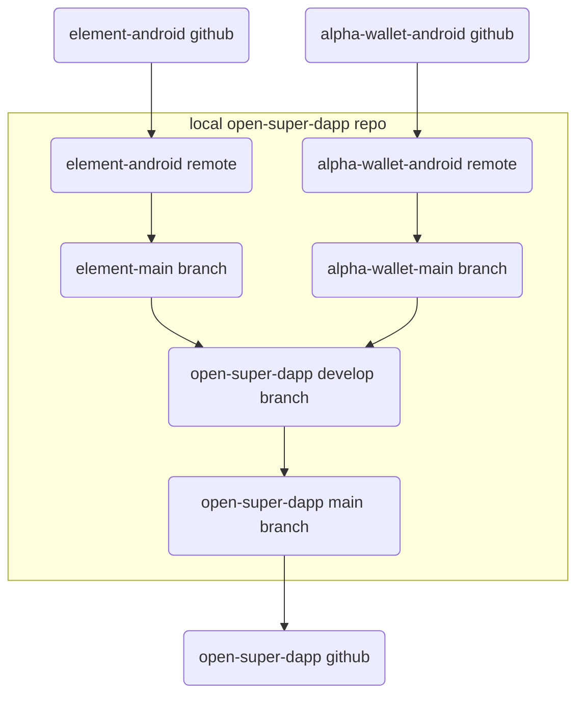

## Upgrading / Merging

### Differences and issues between Element and Alpha Wallet

1. Element is written in Kotlin and Alpha Wallet is written in Java. These code bases can compile together without a problem. All new OSD code should be written in Kotlin.
2. Element uses [Hilt](https://developer.android.com/training/dependency-injection/hilt-android) dependency injection, but Alpha Wallet uses the older [Dagger](https://developer.android.com/training/dependency-injection/dagger-basics). Hilt is built on top of Dagger. Alpha Wallet dependency injection must be converted from Dagger to Hilt to be compatible.
3. Alpha Wallet uses slightly different theming than Element, and new colors require some special handling (discussed below).

### How to upgrade Open Super dApp with new releases of Element and Alpha Wallet 

Open Super dApp (OSD) is downstream of Element and Alpha Wallet and when there is a new release, changes can be merged in from these projects. This document explains how the code bases are connected and how that process works.




### Preparation and code flow
A few steps are necessary to facilitate the connection between the upstream repos and OSD locally for development.

1. Clone the [open-super-dapp-android](https://github.com/2gatherproject/open-super-dapp-android) repository locally.
2. Run the script `./open-super-dapp/scripts/setup-local-repo.sh element-version alpha-wallet-version` (e.g. `./open-super-dapp/scripts/setup-local-repo.sh v1.4.24 v3.57.0`) in the root of the repo. This will add git remotes for the two upstream repos and add set the branches `element-main` and `alpha-wallet-main` to the specified version releases. This script can be run many times and will only perform necessary steps.
3. Create a working branch off of the `main` branch (lets call it `WIP` for now).
4. Merge the `element-main` branch into `WIP`, resolve any conflicts and commit changes.
5. Merge the `alpha-wallet-main` branch into `WIP`, resolve any conflicts and commit changes. This may require use of git's `--allow-unrelated-histories` option.
6. Check for new Alpha Wallet Java files and convert Dagger dependency injection to Hilt. (See existing files from previous releases of OSD for examples of how to do this.)
7. Look for new colors used by Alpha Wallet and follow the process below to integrate them into the theming of Element.
8. Lint the code base.
9. Confirm tests pass.
10. Manually confirm functionality of OSD. (Tests specific to OSD have not yet been written.)
11. Create a PR from your `WIP` branch to the `develop` branch.
12. When a new release to OSD is made, these changes are PRed from `develop` to `main`, a release tag is made and the code is pushed up to the `open-super-dapp-android` repo on github! 

### Notes on themes and colors

Alpha Wallet has a different way of implementing dark/light theming from Element and theming of OSD. This can cause views to break until the new color is properly handled.

When a new color attribute is added in Alpha Wallet, it must be re-implemented this way:

0. Assume for this example the new color is `colorSurfaceSecondary`.
1. Add below declarations to `library/ui-styles/src/main/res/values/colors.xml`
    ```
    <attr name="colorSurfaceSecondary" format="color"/>
    <color name="colorSurfaceSecondary_dark">@color/venus</color>
    <color name="colorSurfaceSecondary_light">@color/alabaster</color>
    ```
2. Add this style item to `library/ui-styles/src/main/res/values/theme_dark.xml`, under `Base.Theme.Vector.Dark`
    ```
    <item name="colorSurfaceSecondary">@color/colorSurfaceSecondary_dark</item>
    ```
3. Add this style item to `library/ui-styles/src/main/res/values/theme_light.xml`, under `Base.Theme.Vector.Light`
    ```
    <item name="colorSurfaceSecondary">@color/colorSurfaceSecondary_light</item>
    ```
4. Confirm views are loading as expected.    
